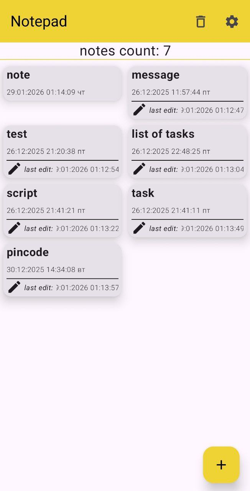
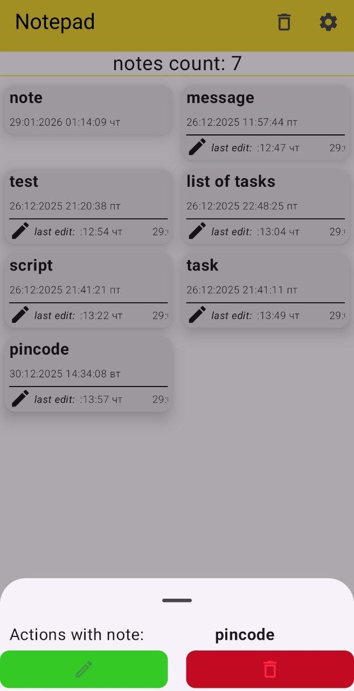
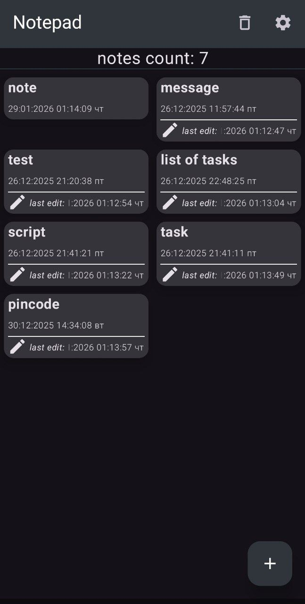
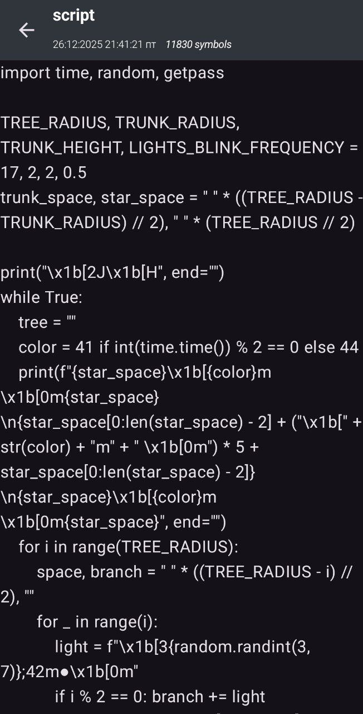
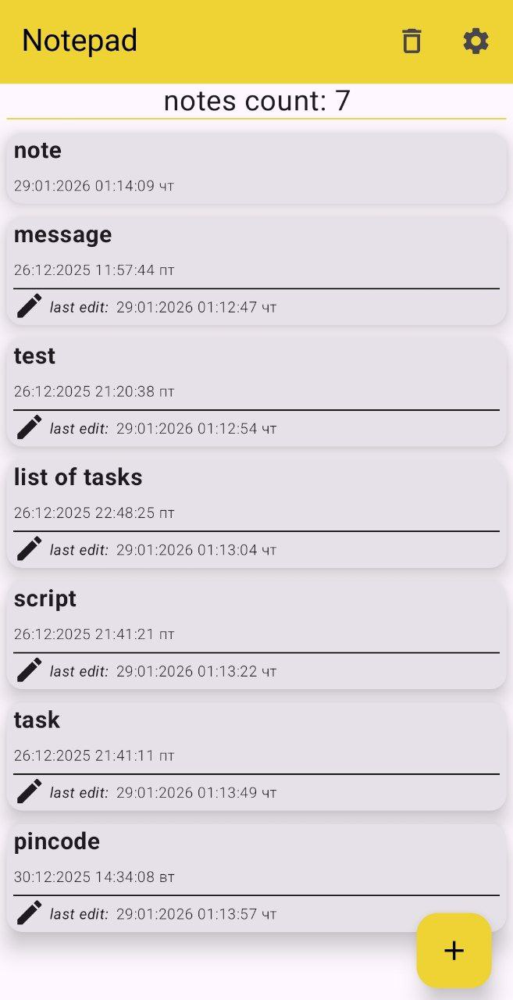

# Notepad

**Notepad** a simple and minimalistic android app📱 for notes📃
Based on *Room* and *Jetpack Compose*.

## Gallery (light and dark themes)
<table>
    <tr>
        <td>
            
        </td>
        <td>
            
        </td>
        <td>
            
        </td>
        <td>
            
        </td>
        <td>
            
        </td>
        <td>
            
        </td>
    </tr>
</table>

## Possibilities
* creating a note
* deleting a note
* editing a note
* deleting all notes

## Features
* grid notes list mode
* note last edit time view

## Used libs📃:
* Dagger-Hilt
* Room
* Ksp
* Viewmodel
* data store

## Android Versions
Android 8.0 and later

## How to use?
The functionality is fairly standard and straightforward. The plus button at the bottom creates a new note. A single tap on a note will view it, and a long press will bring up a menu with options for editing or deleting it. You can also delete all notes, and there are also mini settings where you can change the notes list display mode to grid.