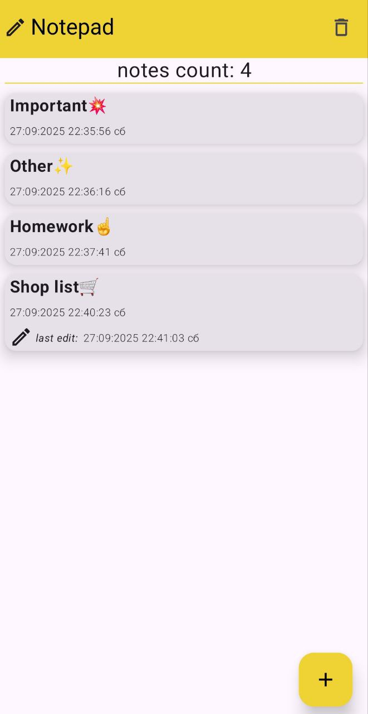
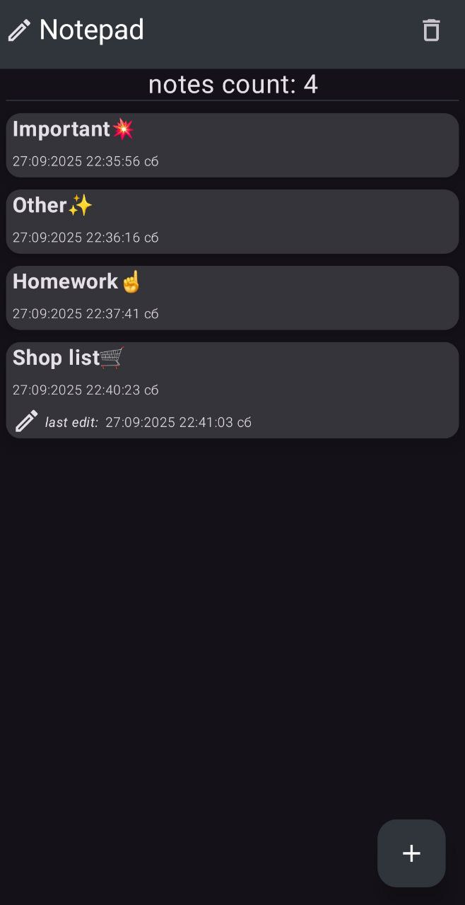

# Notepad
Notepad a simple and minimalistic android app📱 for notes📃
Based on *MVVM Architecture*, *Room* and *Jetpack Compose*.

# Gallery🖼️

## Light theme
| Main screen | Note View | Edit note | Create Note |
|:-----------------------:|:-----------------------:|:-----------------------:|:-----------------------:|
|  |  |  |  |

## Dark theme
| Main screen | Note View | Edit note | Create Note |
|:-----------------------:|:-----------------------:|:-----------------------:|:-----------------------:|
|  |  |  |  |

# Possibilities

* creating a note
* deleting a note
* editing a note
* deleting all notes

# Used libs📃:

* Dagger-Hilt
* Room
* Ksp
* Viewmodel
